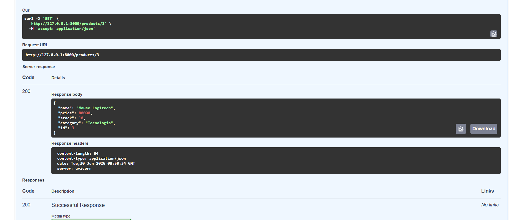

# API Inventario v1 con FastAPI, SQLAlchemy y SQLite

## Descripción

Este proyecto consiste en el desarrollo de una API REST para la administración de un inventario básico utilizando **FastAPI**, **SQLAlchemy** y **SQLite**.

La aplicación permite realizar operaciones CRUD (Crear, Consultar, Actualizar y Eliminar) sobre productos, almacenando la información en una base de datos SQLite.

Este proyecto fue desarrollado siguiendo una arquitectura por capas, aplicando buenas prácticas de organización del código y validación de datos mediante Pydantic.

---

## Objetivos

* Desarrollar una API REST utilizando FastAPI.
* Implementar una arquitectura por capas.
* Utilizar SQLAlchemy como ORM.
* Conectar la aplicación con una base de datos SQLite.
* Validar los datos mediante Pydantic.
* Implementar las operaciones CRUD para la gestión de productos.

---

## Tecnologías utilizadas

* Python 3.x
* FastAPI
* SQLAlchemy
* SQLite
* Pydantic
* Uvicorn

---

## Estructura del proyecto

```text
api_inventario/
│
├── app/
│   ├── routers/
│   │   ├── __init__.py
│   │   └── products.py
│   │
│   ├── __init__.py
│   ├── crud.py
│   ├── database.py
│   ├── main.py
│   ├── models.py
│   └── schemas.py
│
├── inventario.db
├── requirements.txt
└── README.md
```

---

## Instalación

### 1. Clonar el proyecto

```bash
git clone <URL_DEL_REPOSITORIO>
```

Entrar al proyecto

```bash
cd api_inventario
```

---

### 2. Crear el entorno virtual

Windows

```bash
python -m venv .venv
```

Activar el entorno

```bash
.venv\Scripts\activate
```

---

### 3. Instalar dependencias

```bash
pip install -r requirements.txt
```

Si no existe el archivo requirements.txt:

```bash
pip install fastapi uvicorn sqlalchemy pydantic
```

---

## Ejecutar la aplicación

Desde la carpeta principal ejecutar:

```bash
uvicorn app.main:app --reload
```

Si todo está correcto aparecerá un mensaje similar a:

```text
INFO: Uvicorn running on http://127.0.0.1:8000
```

---

## Documentación de la API

Swagger

```
http://127.0.0.1:8000/docs
```

---

## Base de datos

La aplicación utiliza SQLite.

Al ejecutar el proyecto por primera vez se crea automáticamente el archivo:

```text
inventario.db
```

Dentro de este archivo se almacena la información de todos los productos.


---
# Capturas de Pantalla 




---


## Conclusión

Este proyecto permitió aplicar los conceptos fundamentales del desarrollo de APIs REST utilizando FastAPI y SQLAlchemy. Además, se comprendió el funcionamiento de una arquitectura por capas, el uso de un ORM para interactuar con bases de datos y la importancia de validar la información antes de almacenarla. Gracias a Swagger fue posible probar cada uno de los servicios desarrollados de manera rápida y sencilla.

---

## Autor

**Nombre:** Brayan Steven Moreno Gutierrez

**Proyecto:** API Inventario v1

**Tecnologías:** FastAPI · SQLAlchemy · SQLite · Pydantic

